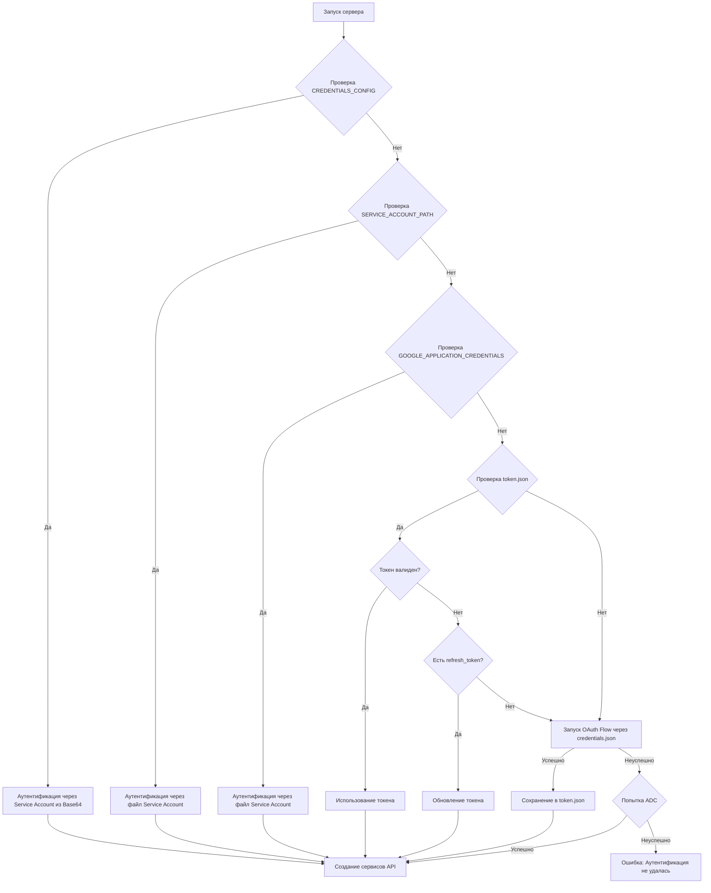

# Структура проекта MCP-сервера для Google Sheets

Этот документ служит "банком памяти" и описывает архитектуру и структуру кода MCP-сервера для взаимодействия с Google Sheets.

## 1. Обзор проекта

Проект представляет собой MCP-сервер, построенный на фреймворке `FastMCP`. Он предоставляет набор инструментов (`tools`) и ресурсов (`resources`) для чтения, записи и управления данными в Google Spreadsheets и файлами на Google Drive.

## 2. Архитектура

- **Фреймворк**: `FastMCP` - асинхронный фреймворк для создания MCP-серверов.
- **Управление жизненным циклом**: Функция `spreadsheet_lifespan` используется как `asynccontextmanager` для управления ресурсами. Она выполняет аутентификацию и создает экземпляры сервисов Google API при запуске сервера и корректно их обрабатывает при завершении работы.

## 3. Аутентификация

Сервер поддерживает несколько механизмов аутентификации с четким приоритетом:

1.  **Service Account (JSON в Base64)**: Через переменную окружения `CREDENTIALS_CONFIG`.
2.  **Service Account (файл)**: Через `SERVICE_ACCOUNT_PATH` или стандартную переменную `GOOGLE_APPLICATION_CREDENTIALS`.
3.  **OAuth 2.0 (пользовательский)**: Используя `credentials.json` для получения токена и `token.json` для его хранения. Запускает локальный сервер для получения согласия пользователя, если токен отсутствует или истек.
4.  **Application Default Credentials (ADC)**: В качестве последнего варианта, автоматически ищет учетные данные в стандартных местах (`gcloud auth`, метаданные и т.д.).

### Диаграмма потока аутентификации

## 4. Ключевые модули и зависимости

- **`google-api-python-client`**: Основная библиотека для взаимодействия с API Google.
  - **`googleapiclient.discovery.build`**: "Фабрика" для создания сервисных объектов (`sheets_service` и `drive_service`).
- **`google-auth`** и **`google-auth-oauthlib`**: Библиотеки для обработки всех процессов аутентификации.
- **API Google**:
  - **Sheets API v4**: Для всех операций с содержимым и структурой таблиц.
  - **Drive API v3**: Для операций на уровне файлов (создание, листинг, предоставление доступа).

## 5. Структура кода (`server.py`)

- **Константы и конфигурация**: Глобальные переменные для путей к файлам, `SCOPES` и `DRIVE_FOLDER_ID`.
- **`SpreadsheetContext` (dataclass)**: Контейнер для хранения созданных сервисов (`sheets_service`, `drive_service`) и `folder_id` для передачи между функциями.
- **`spreadsheet_lifespan`**: Основная функция инициализации. Выполняет логику аутентификации и создает сервисы.
- **Инструменты (`@mcp.tool`)**: Функции, доступные для вызова через MCP. Логически сгруппированы:
  - **Чтение**: `get_sheet_data`, `get_sheet_formulas`, `list_sheets`, `get_multiple_sheet_data`, `get_multiple_spreadsheet_summary`.
  - **Запись/Обновление**: `update_cells`, `batch_update_cells`, `add_rows`, `add_columns`.
  - **Управление**: `copy_sheet`, `rename_sheet`.
  - **Создание**: `create_spreadsheet`, `create_sheet`.
  - **Google Drive**: `list_spreadsheets`, `share_spreadsheet`.
- **Ресурсы (`@mcp.resource`)**:
  - `get_spreadsheet_info`: Предоставляет информацию о таблице по URI вида `spreadsheet://<id>/info`.
